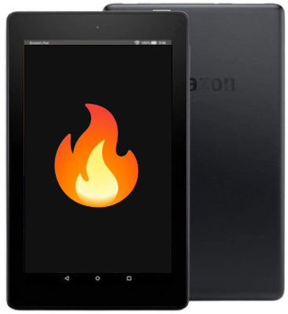
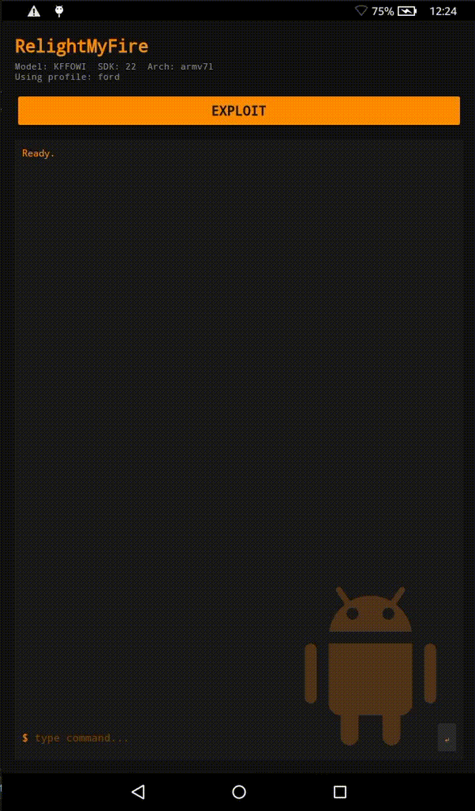

  

# Relight My Fire

Kernel exploit for Amazon Fire 7 5th (`ford`) and 7th (`austin`), packaged into an apk for easy interaction with a root-privileged command line without needing `adb`. Works on what seems to be latest FireOS versions for these tablets at the time of writing. This does not provide a permanent root, it is just an exploit.

Supported devices:

| Model | FireOS Version |
| - | - |
| 5th (`ford`) | `5.7.0.0` (won't let me update higher?) |
| 7th (`austin`) | `5.7.1.0` |

Also includes exploits for the unofficial LineageOS 14.1 released for these, not much use for anything at all if you're already rooted, but was curious if that also had the bug as its the most recent firmware for these things.

Take a look at [my RIPMaliUtgard repo](https://github.com/lr-m/RIPMaliUtgard) for more details on the vulnerability used for this.

## Example Run

